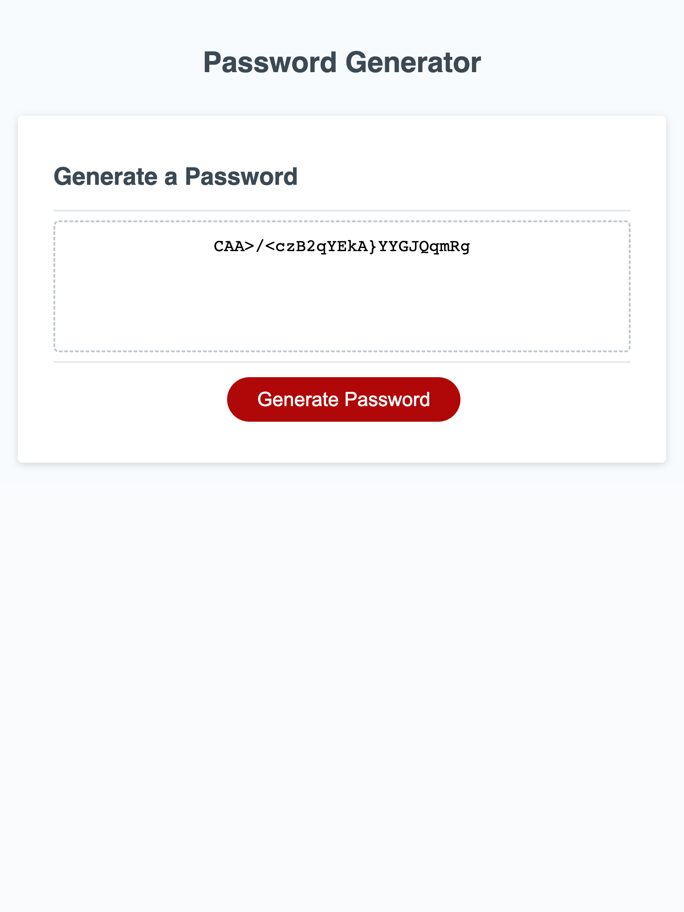

# Password Generator - JavaScript Week 3 Challenge

## Description

For this module's challenge, we were asked to write code in JavaScript for a random password generator. With this generator, a user can input any length of password 8-128 characters, and choose from lowercase, uppercase, numbers, and special characters to include. Since the passwords generated are random, they would work for a user who wants a secure password that can't easily be guessed, and can work with any system password requirements, since the user specifies what those are.  

I learned a lot writing this code! The main portion was to write the "generatePassword" function that is called in the "writePassword" function that was provided for us in the starter code. There was a lot of trial and error to get to the final result but it was super fun and satisfying to get to the final result! I learned a lot about how to use the concatenation operator / method, the prompt and confirm commands for user inputs, and the math.random function. I also learned a little about event listeners even though we haven't quite gotten there in class yet and that code was provided for us (though I did add an additional event listener to this code).  

## User Story  

AS AN employee with access to sensitive data  
I WANT to randomly generate a password that meets certain criteria  
SO THAT I can create a strong password that provides greater security  

## Acceptance Criteria  

GIVEN I need a new, secure password  
WHEN I click the button to generate a password  
THEN I am presented with a series of prompts for password criteria  
WHEN prompted for password criteria  
THEN I select which criteria to include in the password  
WHEN prompted for the length of the password  
THEN I choose a length of at least 8 characters and no more than 128 characters  
WHEN asked for character types to include in the password  
THEN I confirm whether or not to include lowercase, uppercase, numeric, and/or special characters  
WHEN I answer each prompt  
THEN my input should be validated and at least one character type should be selected  
WHEN all prompts are answered  
THEN a password is generated that matches the selected criteria  
WHEN the password is generated  
THEN the password is either displayed in an alert or written to the page  

## Table of Contents

- [Usage](#usage)  
- [Credits](#credits)  
- [Features](#features)  

## Usage

You can visit the published GitHub Pages and use the password generator yourself here: https://randirose.github.io/week-3-challenge/  

You can visit the GitHub repo here: https://github.com/randirose/week-3-challenge  

    
    
I wanted to include a video of the generator in action, but screencasting doesn't show the window prompts or confirmations.  

## Credits

- Starter code from course  
- AskBCS on Slack  

## Features

Additional features in my project include:  

- Event listener at the end that, when the user "focuses" on the text area (clicks inside the text box) after generating their password, it will automatically select all the text to make it easy for the user to copy.

